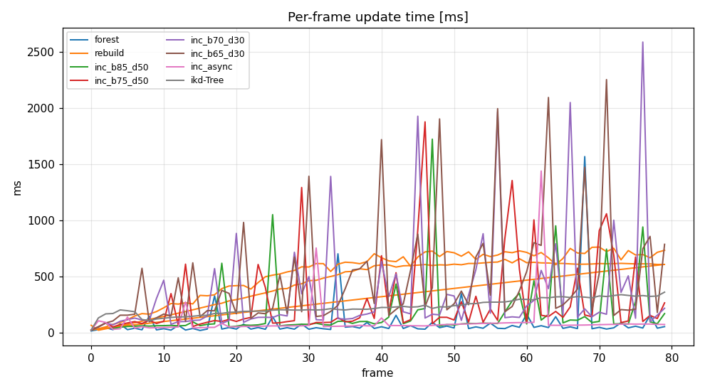

# Incremental dynamic k-d tree — design & performance report

`KDTreeSingleIndexIncrementalAdaptor` is a new, additive dynamic index for
nanoflann: a **single, self-balancing k-d tree** for point sets that change over
time, aimed at real-time LiDAR-mapping workloads (heavy interleaved
insert / delete / query, sliding-window map maintenance). It is an alternative
to the existing `KDTreeSingleIndexDynamicAdaptor` (the Bentley–Saxe
"logarithmic forest").

This document records the design decisions and the benchmarks that justify
them. The benchmark code is in this directory (see [`README.md`](README.md) to
build & run). See also [`async_rebalance.md`](async_rebalance.md) for the
threading analysis. The index itself ships in the
[nanoflann](https://github.com/jlblancoc/nanoflann) header.

---

## 1. The strategies compared

| Strategy | nanoflann class | Insert | Delete | Box trim | Query |
|---|---|---|---|---|---|
| **forest** | `KDTreeSingleIndexDynamicAdaptor` | Bentley–Saxe merge of ⌈log₂N⌉ static sub-trees | lazy tombstone | not supported (`removePoint` every point) | query *all* ⌈log₂N⌉ sub-trees (×log N penalty) |
| **rebuild** | `KDTreeSingleIndexAdaptor`, cleared+rebuilt every frame | rebuild whole index O(N log N) | drop from input vector | filter input vector | one optimally-balanced leaf-bucket tree (fastest) |
| **incremental** | `KDTreeSingleIndexIncrementalAdaptor` (new) | descend+insert (amortized O(log N)), weight-balanced partial rebuilds, bulk-build for large batches | lazy tombstone, reclaimed on rebuild | `removeOutsideBox`/`removeBox`, AABB-pruned | one tree (no log-N factor) |

We also benchmark, externally, **ikd-Tree** (HKU-MARS, GPLv2) — the design that
inspired this work. ikd-Tree code is *not* used inside nanoflann; only the
published algorithms were reimplemented from scratch (BSD).

---

## 2. Design decisions (and why)

- **One point per node** (not leaf buckets): a leaf-bucket layout (the static
  index) cannot accept a single new point without shifting a contiguous index
  range. One point per node makes insert/delete O(tree height). Same structural
  choice as ikd-Tree; it is also why both have a higher per-query constant than
  the leaf-bucket static tree.
- **Node augmentation**: `subtree_size`, `invalid_count` (tombstones), and a
  subtree **AABB**. The AABB lets `removeOutsideBox` certify "this whole subtree
  is outside the keep region" and drop it in O(1) — split planes alone cannot do
  this for a box *complement*. The pure-KNN static index keeps its lean nodes.
- **Allocator = pooled bump-allocation + a typed free-list** (plan §9.3 option 1).
  Nodes bump-allocate on the hot path; a partial rebuild recycles the old
  subtree's nodes onto a free-list that the rebuild draws from first, so a
  steady-state sliding window has ≈ 0 net pool growth. A full root rebuild just
  `free_all`s the pool. This is what keeps steady-state memory bounded (§3).
- **Weight-balanced (scapegoat / BB[α]) partial rebuilds**, with the balance
  check folded into the insertion unwind (no second descent). After deletions,
  the highest subtree whose tombstone fraction exceeds `alpha_deleted` is
  rebuilt, physically dropping tombstones and reclaiming nodes — bounding memory.
- **Per-node coordinate cache** (fixed `DIM` only) and **bulk insert** — see §4.
- **Synchronous core, optional async wrapper.** The base class is synchronous, so
  its O(N) near-root rebuild spike is visible in the update tail. For workloads
  that need a bounded tail, `KDTreeSingleIndexIncrementalAdaptorMT` offloads the
  big rebuild to a background thread (opt-in, `NANOFLANN_NO_THREADS`-gated). See
  [`async_rebalance.md`](async_rebalance.md) and §3.1.

> A **compile-time fixed `DIM`** (e.g. 3 for LiDAR) is recommended: the per-node
> box and coord-cache are then stack `std::array`s — no per-node heap. With
> `DIM=-1` the box is a `std::vector` and the coord-cache is disabled.

---

## 3. Benchmark results

Workload: scans accumulated assuming constant-velocity motion; after each scan
the map is trimmed to a cube around the sensor (`removeOutsideBox`) and a batch
of `k=5` KNN queries (a subsample of the scan) is run. Steady-state statistics
skip the warm-up frames. `-O3 -march=native`, `float`, `DIM=3`, `L2_Simple`.

### 3.1 KITTI seq-00, large persistent map (~4.8 M points, 80 scans)
`keepHalf=60 m`, ~122 k points/scan.

| method | upd median [ms] | upd p95 [ms] | upd mean [ms] | query [µs/q] | live | phys |
|---|---:|---:|---:|---:|---:|---:|
| forest | **47.1** | 348.7 | 103.1 | 17.7 | 4 818 272 | 9 724 011 |
| rebuild (1 thr) | 611.2 | 630.6 | 583.9 | **2.0** | 4 818 272 | 4 818 272 |
| rebuild (mt) | 682.8 | 753.3 | 671.8 | 3.2 | 4 818 272 | 4 818 272 |
| **incremental** (α_bal 0.85, sync) | 92.0 | 943.0 | 197.6 | 7.1 | 4 818 272 | 6 471 459 |
| incremental (α_bal 0.75, sync) | 143.5 | 1294.7 | 345.0 | 7.1 | 4 818 272 | 5 782 299 |
| **incremental MT** (async rebuild) | 71.5 | **132.3** | 110.8 | 10.9 | 4 818 272 | 9 308 215 |
| ikd-Tree | 260.5 | 333.2 | 265.8 | 14.0 | 4 818 272 | 9 260 468 |



**Read-out.** At this scale `rebuild` is impractical (≈ 0.6 s/frame — it rebuilds
the whole 4.8 M-point map every frame). The **synchronous** incremental tree has
the best median update latency of the bounded-memory exact methods (92 ms — 6×
faster than rebuild, 2.8× faster than ikd-Tree's median) and keeps **single-tree
query speed**, far ahead of the forest (7.1 vs 17.7 µs/q — the forest pays its
×log N factor at N=4.8 M). Its weakness is the update **tail** (p95 ≈ 0.94 s) —
the synchronous near-root rebuild.

The **multi-threaded** variant (`KDTreeSingleIndexIncrementalAdaptorMT`) closes
exactly that gap: offloading the big rebuild to a background thread drops the
update **p95 from 943 → 132 ms (7×)** and the median to 71 ms — beating ikd-Tree
on update median, p95 *and* query simultaneously. The price is a higher query
latency (10.9 vs 7.1 µs/q — the active tree is less balanced between background
rebuilds) and ~2× memory (like ikd-Tree), both tunable via the rebuild-trigger
growth factor. See [`async_rebalance.md`](async_rebalance.md) for the design.

### 3.2 The advantage over `rebuild` grows with map size
Update **median** [ms] and query [µs/q] for the recommended `incremental`
(α_bal 0.85) vs the alternatives, across three map sizes (all sliding-window):

| map (live pts) | rebuild upd | ikd upd | **incremental upd** | forest qry | ikd qry | **incremental qry** | rebuild qry |
|---|---:|---:|---:|---:|---:|---:|---:|
| 0.78 M (random) | 78–98 | 65 | **37** | 6.7 | 7.9 | **6.7** | 2.0 |
| 3.06 M (KITTI) | 266 | 196 | **89** | 16.5 | 7.2 | **7.2** | 1.9 |
| 4.82 M (KITTI) | 611 | 260 | **92** | 17.7 | 14.0 | **7.1** | 2.0 |

`rebuild`'s per-frame cost scales with the whole map, so the incremental tree's
update advantage widens as the map grows; its query stays ~flat and always beats
the forest. `rebuild` keeps the best *query* (an optimal leaf-bucket tree) when
its per-frame rebuild cost still fits the time budget (small maps only).

### 3.3 Memory under churn — the forest's failure mode
`phys` (physically stored nodes) vs `live` (logical points):

| method | random (0.78 M) phys | KITTI (4.82 M) phys | bounded? |
|---|---:|---:|---|
| forest | 900 000 (= **all** inserts) | 9 724 011 (≈ **2× live**) | **no** — grows with total inserts |
| incremental | 858 330 (1.10×) | 6 471 459 (1.34×) | yes (α_deleted rebuilds) |
| ikd-Tree | 856 817 (1.09×) | 9 260 492 (1.92×) | partially |
| rebuild | 782 835 (= live) | 4 818 272 (= live) | yes |

On the random run the forest's `phys` equals *every point ever inserted*: its
largest sub-tree never rebuilds, so trimmed points are never reclaimed and memory
grows with total inserts, not the window. The incremental index reclaims
tombstones via the `alpha_deleted` rebuild trigger (the
`bounded_memory_under_churn` unit test asserts this). A smaller `alpha_deleted`
(e.g. 0.3) drives `phys` down to ≈ `live` at the cost of more frequent rebuilds.

---

## 4. Optimizations (benchmarked; kept or discarded)

Measured on the synthetic sliding-window run (inc α_bal 0.85, 600 q/frame,
back-to-back on identical machine state):

| variant | query [µs/q] | update mean [ms] | verdict |
|---|---:|---:|---|
| no cache (baseline) | 10.2 | 56 | — |
| **+ in-node coord cache** (split + box) | 7.0 (**−28 %**) | 48 (**−12 %**) | **kept, default for `DIM>0`** |
| + in-node distance (additive metrics) | 6.35 (**−37 %**) | 48 | kept as **opt-in** macro |

- **In-node coordinate cache** *(kept, on by default for fixed `DIM`)*: each node
  caches its point's coordinates, removing the `kdtree_get_pt` indirection on the
  hot paths. Used for the split comparison and box tests, which is **always
  metric-correct**. Stack `std::array` for `DIM>0` (no per-node heap); disabled
  for `DIM=-1`. Opt out with `NANOFLANN_INCREMENTAL_NO_COORD_CACHE`.
- **In-node distance** *(opt-in: `NANOFLANN_INCREMENTAL_INNODE_DISTANCE`)*:
  computes the node distance from the cached coords as a sum of per-axis
  `accum_dist`. Worth another ~12 % on KNN, but only valid for **additive**
  metrics (L1 / L2 / L2_Simple) — *not* SO2/SO3 — so it is left off by default.
- **Bulk insert in `addPoints`** *(kept)*: when a batch is large relative to the
  live count (an empty tree, or a full scan rebuilding a heavily-trimmed map),
  flatten the live points and build one balanced tree instead of descend-inserting
  each point and tripping near-root rebuilds. This removed the only regime where
  the incremental index used to lose to `rebuild`: on a high-churn small map it
  now does **73 ms** median update vs `rebuild`'s 115 ms, with a tight p95 (81 ms).
  Low-churn behaviour is unchanged (the threshold is not tripped).

Discarded: nothing outright — the in-node distance is gated rather than removed
because it is a real win for the dominant L2 case.

---

## 5. Tuning `alpha_balance` / `alpha_deleted`

Sweep on the 4.8 M-point map (update mean / p95, query):

| (α_bal, α_del) | upd mean [ms] | upd p95 [ms] | query [µs/q] |
|---|---:|---:|---:|
| (0.85, 0.50) | **207.7** | **979** | 7.6 |
| (0.75, 0.50) | 346.7 | 1280 | 7.3 |
| (0.70, 0.30) | 473.2 | 2104 | 7.3 |
| (0.65, 0.30) | 601.3 | 2056 | 7.2 |

A **looser** balance threshold (0.85) gives the best update mean *and* the best
update tail at a negligible (<5 %) query cost: stricter thresholds trip rebuilds
more eagerly and at higher nodes, producing larger near-root rebuilds. Query is
almost insensitive to α.

**Recommended design point:** the library default is a conservative
`alpha_balance = 0.75, alpha_deleted = 0.5` (tighter tree height). For
**update-latency-critical LiDAR**, set `alpha_balance ≈ 0.8–0.85` (a one-line
`KDTreeIncrementalIndexParams` change); lower `alpha_deleted` (≈0.3) if you want
`phys` ≈ `live`.

---

## 6. Recommendation

- **Use the incremental index for sliding-window mapping** (large persistent map,
  per-frame insert+trim+query): best median update latency of the bounded-memory
  exact methods, single-tree query speed, native `removeOutsideBox`/`removeBox`,
  and bounded memory — with the advantage over `rebuild` widening as the map grows.
- **Prefer it over the forest** when query latency or memory-under-churn matter:
  no ×log N query factor, and it reclaims deletion garbage.
- **`rebuild` remains best** when the map is small enough that a full rebuild fits
  the per-frame budget and minimum query latency is paramount.
- **Use the multi-threaded `KDTreeSingleIndexIncrementalAdaptorMT`** when the
  **update-latency tail** must be bounded (hard real-time, e.g. FAST-LIO-style
  odometry): it offloads the big rebuild to a background thread, cutting the p95
  by ~7× (943 → 132 ms here) and beating ikd-Tree on update median, p95 and query
  — at the cost of higher query latency and ~2× memory (both tunable). See
  [`async_rebalance.md`](async_rebalance.md). Requires stable dataset storage
  during a rebuild and is disabled under `NANOFLANN_NO_THREADS`.

## 7. Synchronizing the user's dataset storage

The index is **zero-copy**: it stores point *indices* into the user's dataset
adaptor, not the coordinates. So the caller and the index must agree on what each
index means, in two situations.

### 7.1 Inserting a scan
Append the new points to the dataset, then hand the index their (contiguous)
index range:

```cpp
const uint32_t start = cloud.size();
for (auto& p : scan) cloud.push_back(p);        // user owns the storage
index.addPoints(start, cloud.size() - 1);       // indices are stable
```

The only rule: the point data at index `i` must be written **before**
`addPoint(i)` (the index reads coordinates during insertion, and — for fixed
`DIM` — caches them in-node). With the **MT** index the background thread also
reads dataset coordinates, so the backing storage must not reallocate while a
rebuild is in flight: `reserve()` the vector (or use a `std::deque`).

### 7.2 Removing points — and reclaiming dataset slots
`removePoint`, `removeBox` and `removeOutsideBox` only *tombstone* indices; the
coordinates stay in the user's dataset. Over a long session the dataset would
grow with the *total* number of points ever inserted, even though the live set
is windowed. To bound it, recycle the slots the index has physically dropped:

```cpp
index.setCollectRemovedPoints(true);            // once, after construction
...
index.removeOutsideBox(keep);                   // trim the map
for (uint32_t slot : index.acquireRemovedPoints())
    freeList.push_back(slot);                   // these slots are safe to reuse
...
// next scan: reuse a freed slot instead of appending
uint32_t slot;
if (!freeList.empty()) { slot = freeList.back(); freeList.pop_back(); cloud[slot] = p; }
else                   { slot = cloud.size();    cloud.push_back(p); }
index.addPoint(slot);
```

`acquireRemovedPoints()` returns an index **only once no live or tombstoned tree
node references it** (i.e. after the rebuild that physically dropped it), so
overwriting that dataset slot can never corrupt the tree. This is the
synchronization contract for deletion. With `removeOutsideBox`, tombstones are
reclaimed lazily as the `alpha_deleted` rebuild trigger (or, for the MT index,
the background swap) fires; so a slot may be reported a few frames after the
logical removal — never before it is safe.

Measured (constant-velocity churn, 200 frames × 1000 pts = 200 k inserts; the
`*_acquireRemovedPoints` and `*_slot_recycling_bounds_dataset` unit tests):

| index | live | dataset slots used (peak) | vs. no recycling |
|---|---:|---:|---:|
| incremental (sync) | ~10.5 k | ~17 k (1.6× live) | 200 k |
| incremental MT | ~10.5 k | ~25 k (2.4× live) | 200 k |

So slot recycling keeps the dataset bounded to a small multiple of the live set
instead of growing without bound. (It also removes the MT realloc hazard, since a
recycled dataset never grows.) `acquireRemovedPoints()` is available on both the
synchronous and MT indices and is cost-free unless `setCollectRemovedPoints(true)`.

## 8. Reproducing

```bash
cd incrementalTests                         # this directory (in nanoflann-benchmark)
./fetch_ikdtree.sh                          # external GPLv2 baseline (not committed)
source ~/ros2_ws/install/setup.bash         # optional KITTI loader (mola)
cmake -S . -B build && cmake --build build -j
export KITTI_BASE_DIR=/path/to/kitti/ KITTI_SEQ=00
# args: <frames> <keepHalf_m> <dx_m/frame> <queries/frame> <out.csv>
./build/benchmark_incremental 80 60 1.5 300 stats.csv      # large map (§3.1)
KITTI_BASE_DIR= ./build/benchmark_incremental 30 60 1.5 600 stats.csv   # random
python3 analyze.py stats.csv out_prefix <warmup_frames>    # tables + plots
```
